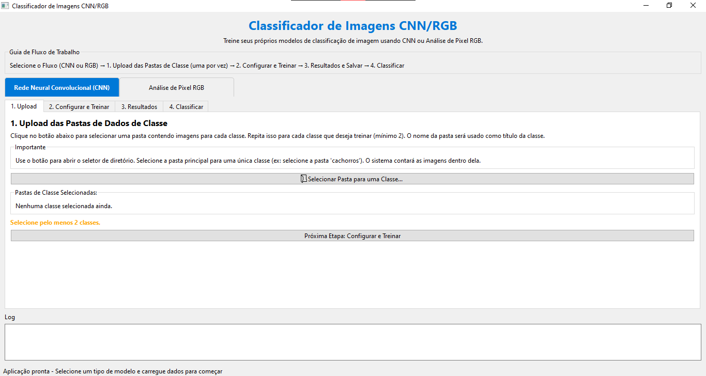

# Classificador de Imagens CNN/RGB

Uma aplicação com interface gráfica para análise de imagens e classificação usando redes neurais. O sistema oferece duas modalidades de análise: RGB Feature Network e Convolutional Neural Network (CNN).



## Funcionalidades

- **Análise de características RGB**: Extrai características baseadas em cores de imagens e classifica-as usando redes neurais densas.
- **Redes Neurais Convolucionais**: Treinamento completo de CNNs para classificação direta de imagens.
- **Interface de usuário intuitiva**: Fluxo guiado em três etapas: Upload, Configuração/Treinamento e Análise de Resultados.
- **Visualização de resultados**: Gráficos de acurácia e matrizes de confusão para avaliar o desempenho do modelo.
- **Classificação de novas imagens**: Use modelos treinados para classificar novas imagens.
- **Salvamento e carregamento de modelos**: Armazene seus modelos treinados para uso posterior.

## Requisitos do Sistema

- Python 3.8 ou superior
- PySide6 (Qt para Python)
- TensorFlow 2.x
- OpenCV
- NumPy, Pandas e Scikit-learn

## Instalação

1. Clone este repositório:
   ```
   git clone https://github.com/seu-usuario/neural-network-feature-extractor.git
   cd neural-network-feature-extractor
   ```

2. Instale as dependências:
   ```
   pip install -r requirements.txt
   ```

3. Execute a aplicação:
   ```
   python main.py
   ```

## Guia de Uso

### 1. Upload de Dados

1. Na primeira aba "Upload", clique em "Selecionar Pasta para uma Classe..."
2. Selecione uma pasta contendo imagens para uma classe específica
3. Repita este processo para adicionar todas as classes necessárias (mínimo 2)
4. A aplicação contará automaticamente as imagens em cada pasta selecionada
5. Quando tiver pelo menos duas classes, avance para a próxima etapa

### 2. Configuração e Treinamento

#### Modelo CNN

Usando CNNs para classificação direta de imagens:

1. Selecione "CNN" como tipo de modelo
2. Configure os parâmetros da rede:
   - **Camadas**: Número de camadas densas
   - **Neurônios por Camada**: Número de neurônios nas camadas densas
   - **Épocas de Treinamento**: Quantidade de épocas para o treinamento
   - **Divisão Treino/Teste**: Proporção entre dados de treino e teste

3. Clique em "Treinar Modelo CNN" para iniciar o treinamento

#### Modelo RGB Feature

Usando características RGB para classificação:

1. Selecione "RGB" como tipo de modelo
2. Defina atributos RGB para cada classe:
   - Os seletores RGB serão criados para cada classe automaticamente
   - Ajuste os intervalos de cor (R, G, B) para capturar características relevantes
   - Nomeie cada atributo de acordo com o que está tentando capturar

3. Configure os parâmetros da rede:
   - **Camadas**: Número de camadas densas
   - **Neurônios por Camada**: Número de neurônios nas camadas densas
   - **Épocas de Treinamento**: Quantidade de épocas para o treinamento
   - **Divisão Treino/Teste**: Proporção entre dados de treino e teste

4. Clique em "Treinar Modelo RGB" para iniciar o treinamento

### 3. Resultados

Após o treinamento, a aplicação mostrará:

1. **Gráfico de Acurácia**: Evolução da acurácia durante o treinamento
2. **Matriz de Confusão**: Visualização do desempenho do modelo para cada classe
3. **Resumo do Treinamento**: Estatísticas gerais sobre o desempenho do modelo

Opções adicionais:
- **Salvar Modelo**: Salve o modelo treinado para uso posterior
- **Avançar para Classificação**: Use o modelo para classificar novas imagens

### 4. Classificação

1. Carregue um modelo previamente treinado ou use o modelo atual
2. Selecione uma imagem para classificar
3. Visualize os resultados da classificação, incluindo a classe prevista e as probabilidades

## Estrutura do Projeto

```
neural-network-feature-extractor/
├── main.py                      # Ponto de entrada da aplicação
├── requirements.txt             # Dependências do projeto
├── images/                      # Imagens de documentação
│   └── screen.png               # Captura de tela da aplicação
├── ui/                          # Interface do usuário
│   ├── main_window.py           # Janela principal e lógica da UI
│   ├── rgb_selector.py          # Widget para seleção de atributos RGB
│   ├── image_viewer.py          # Visualizador de imagens
│   └── log_widget.py            # Widget para exibição de logs
├── models/                      # Implementações de modelos
│   ├── cnn.py                   # Implementação da rede neural convolucional
│   └── rgb_net.py               # Implementação da rede para atributos RGB
└── utils/                       # Utilitários
    ├── data_processing.py       # Processamento de dados e extração de características
    └── model_utils.py           # Funções para salvar/carregar modelos
```

## Exemplos de Uso

### Classificação de Frutas por Cor

1. Crie pastas para cada tipo de fruta (ex: "maças", "bananas", "laranjas")
2. Coloque imagens representativas em cada pasta
3. Selecione o modo RGB Feature
4. Configure atributos RGB típicos para cada fruta:
   - Maçãs: Predominância de vermelho
   - Bananas: Predominância de amarelo
   - Laranjas: Mistura específica de vermelho e amarelo
5. Treine o modelo e analise os resultados

### Classificação de Objetos Complexos

1. Organize imagens em pastas por categoria (ex: "carros", "bicicletas", "motos")
2. Selecione o modo CNN
3. Configure a rede com pelo menos 3 camadas e 64 neurônios
4. Use um número adequado de épocas (50-100) para permitir a convergência
5. Treine o modelo e analise os resultados

## Solução de Problemas

### O treinamento está muito lento

- Reduza a resolução das imagens ou o número de épocas
- Utilize um computador com GPU para acelerar o treinamento
- Reduza o número de camadas ou neurônios para modelos mais simples

### A acurácia do modelo está baixa

- Aumente o número de imagens por classe
- Experimente com diferentes configurações de rede
- Para o modo RGB, ajuste os seletores para capturar melhor as características
- Verifique se as imagens são representativas e variadas

### A aplicação não inicia

- Verifique se todas as dependências estão instaladas
- Certifique-se de que está usando Python 3.8 ou superior
- Em sistemas Windows, pode ser necessário instalar pacotes adicionais para OpenCV

## Contribuições

Contribuições são bem-vindas! Sinta-se à vontade para abrir issues ou enviar pull requests.

## Licença

Este projeto está licenciado sob a licença MIT - veja o arquivo LICENSE para detalhes.